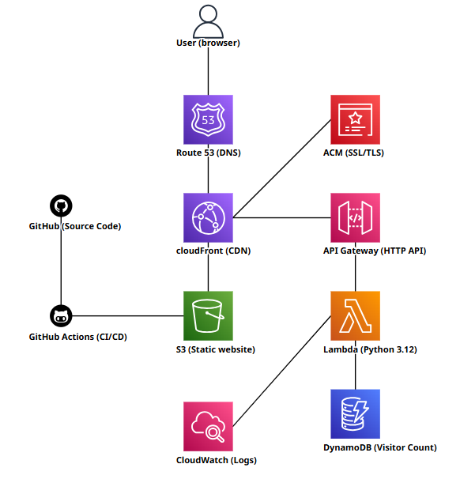

# AWS Cloud Resume Challenge — Full-Stack Serverless Website

## Project Overview

This project is a complete implementation of the [Cloud Resume Challenge](https://cloudresumechallenge.dev/), a hands-on project that demonstrates real-world cloud engineering skills by building and deploying a personal resume website entirely on AWS. The website is live at **[josephnaja.com](https://josephnaja.com)**.

The challenge goes far beyond simple static hosting — it requires integrating multiple AWS services into a cohesive, production-grade architecture that includes a custom domain with HTTPS, a global CDN, a serverless API backend, a NoSQL database, Infrastructure as Code (IaC), and a CI/CD pipeline for fully automated deployments.

---

## Architecture



### How It Works

1. A developer pushes code to the **GitHub** repository
2. **GitHub Actions** automatically syncs website files to **S3** and invalidates the **CloudFront** cache
3. A user visits **josephnaja.com**
4. **Route 53** resolves the domain to the **CloudFront** distribution
5. **CloudFront** serves the static files (HTML, CSS, JS, images) from the **S3** bucket over HTTPS using an **ACM** certificate
6. The browser executes `script.js`, which calls `/api/counter`
7. CloudFront routes `/api/*` requests to **API Gateway**
8. API Gateway triggers the **Lambda** function
9. Lambda increments the visitor count in **DynamoDB** and returns the updated count
10. The visitor count is displayed on the homepage

---

## AWS Services Used

| Service | Purpose |
|---------|---------|
| **S3** | Hosts static website files (HTML, CSS, JS, images) |
| **CloudFront** | Global CDN with HTTPS termination, caching, and origin routing |
| **ACM (Certificate Manager)** | Provisions and manages the TLS/SSL certificate for the custom domain |
| **Route 53** | DNS management — maps the custom domain to CloudFront |
| **API Gateway (HTTP API)** | Exposes a RESTful endpoint for the visitor counter |
| **Lambda** | Serverless function that handles the visitor count logic |
| **DynamoDB** | NoSQL database storing the visitor count |
| **IAM** | Manages permissions for Lambda, CloudFront, and the CI/CD pipeline |
| **CloudFormation** | Infrastructure as Code — defines and deploys the entire stack |

---

## CI/CD Pipeline

The project uses **GitHub Actions** to automate deployments. Every push to the `main` branch triggers the pipeline, which:

1. **Syncs website files to S3** — uploads only changed files and removes deleted ones
2. **Invalidates the CloudFront cache** — ensures visitors see the latest version immediately

The pipeline uses a dedicated IAM user with least-privilege permissions scoped to only the S3 bucket and CloudFront distribution. AWS credentials are stored securely as GitHub repository secrets.

```yaml
on:
  push:
    branches: [main]
```

This means any code change merged to `main` is live within seconds — no manual deployment needed.

---

## Project Structure

```
├── index.html                    # Main website (Home, Resume, Projects, Certifications tabs)
├── style.css                     # Styling with responsive design
├── script.js                     # Tab navigation + visitor counter API call
├── photo.jpeg                    # Profile photo
├── architecture.png              # Architecture diagram
├── lambda/
│   ├── visitor_counter.py        # Lambda function (Python 3.12)
│   └── package.py                # Packaging script to create Lambda deployment zip
├── infrastructure/
│   ├── template.yaml             # CloudFormation template (entire stack)
│   └── deploy.sh                 # One-command deployment script
├── .github/
│   └── workflows/
│       └── deploy.yml            # GitHub Actions CI/CD pipeline
└── PROJECT_DOCUMENTATION.md      # This file
```

---

## Frontend

The website is a single-page application with tab-based navigation, built with vanilla HTML, CSS, and JavaScript — no frameworks, no build tools.

### Tabs
- **Home** — Hero section with profile photo, title, social links, and live visitor counter
- **Resume** — Full professional resume with experience, education, skills, and certifications
- **Projects** — Showcase of hands-on AWS projects
- **Certifications** — AWS and ITIL certifications with badge images and links to Credly credentials

### Visitor Counter
The homepage displays a real-time visitor count. When the page loads, JavaScript makes a `fetch` call to `/api/counter`. CloudFront routes this to API Gateway, which triggers the Lambda function. The count is incremented atomically in DynamoDB and returned to the browser.

```javascript
const res = await fetch('/api/counter');
const data = await res.json();
counter.textContent = data.count;
```

---

## Backend

### Lambda Function (`lambda/visitor_counter.py`)

A lightweight Python function that uses the DynamoDB `UpdateItem` operation with an atomic counter:

```python
response = table.update_item(
    Key={'id': 'visitors'},
    UpdateExpression='ADD visit_count :inc',
    ExpressionAttributeValues={':inc': 1},
    ReturnValues='UPDATED_NEW'
)
```

Key design decisions:
- **Atomic increment** using `ADD` — no race conditions, even under concurrent requests
- **Single-table design** — one item with partition key `id = "visitors"`
- **Minimal IAM permissions** — Lambda role only has `dynamodb:UpdateItem` and `dynamodb:GetItem`

### API Gateway

An HTTP API (not REST API) is used for lower latency and cost. It exposes a single route:

```
GET /api/counter → Lambda integration (AWS_PROXY, payload v2.0)
```

CORS is configured to allow requests only from `https://josephnaja.com` and `https://www.josephnaja.com`.

---

## Infrastructure as Code

The entire infrastructure is defined in a single CloudFormation template (`infrastructure/template.yaml`). This means the full stack can be created, updated, or torn down with one command — nothing is manually configured in the AWS Console.

### Resources Created by the Template

1. **S3 Bucket** — Private bucket with all public access blocked. Only CloudFront can read from it via Origin Access Control (OAC).

2. **ACM Certificate** — DNS-validated TLS certificate for `josephnaja.com` and `www.josephnaja.com`. CloudFormation handles the validation records automatically via the Route 53 hosted zone.

3. **CloudFront Distribution** — Two origins:
   - **S3 Origin** (default) — serves static files with `CachingOptimized` policy
   - **API Origin** — proxies `/api/*` to API Gateway with caching disabled

4. **Route 53 Records** — Alias A records pointing both the apex domain and `www` subdomain to CloudFront.

5. **DynamoDB Table** — On-demand billing (pay-per-request), single partition key.

6. **Lambda Function** — Python 3.12 runtime, 10-second timeout, code deployed from S3.

7. **API Gateway HTTP API** — With Lambda proxy integration and CORS configuration.

8. **IAM Role** — Least-privilege role for Lambda with `AWSLambdaBasicExecutionRole` + scoped DynamoDB access.

### Security Highlights

- S3 bucket is **fully private** — no public access, no static website hosting enabled
- CloudFront uses **Origin Access Control (OAC)** — the modern replacement for OAI
- HTTPS is **enforced** — HTTP requests are redirected to HTTPS
- TLS minimum version is **TLSv1.2_2021**
- Lambda IAM role follows **least privilege** — only the specific DynamoDB actions needed
- CORS restricts API access to the **specific domain only**
- CI/CD IAM user has **scoped permissions** — only S3 and CloudFront actions on specific resources

---

## Deployment

### Initial Stack Deployment

Prerequisites:
- AWS CLI configured with appropriate credentials
- Python 3.x installed
- A Route 53 hosted zone for your domain
- An S3 bucket for Lambda deployment artifacts

```bash
bash infrastructure/deploy.sh
```

The script performs these steps automatically:

1. **Package Lambda** — Runs `lambda/package.py` to create `visitor_counter.zip`
2. **Upload Lambda zip** — Copies the zip to the Lambda artifacts S3 bucket
3. **Deploy CloudFormation** — Creates/updates the entire stack
4. **Seed DynamoDB** — Initializes the visitor counter (skips if already seeded)
5. **Upload website files** — Copies HTML, CSS, JS, and images to the website S3 bucket
6. **Invalidate CloudFront cache** — Ensures visitors see the latest version

### Ongoing Deployments (CI/CD)

After the initial stack is deployed, all website updates are handled automatically by GitHub Actions. Simply push to `main`:

```bash
git add .
git commit -m "Update website"
git push origin main
```

GitHub Actions will sync the files to S3 and invalidate the CloudFront cache. No manual intervention needed.

### First Deploy Note

The first deployment takes 10–30 minutes because:
- ACM certificate DNS validation needs to propagate
- CloudFront distribution creation takes ~15 minutes

Subsequent deployments (updates) are much faster.

---

## Challenges and Lessons Learned

### 1. Cross-Platform Lambda Packaging
The standard `zip` command isn't available in all Windows bash environments, causing Lambda deployment failures with "Could not unzip uploaded file" errors. The solution was to create a standalone Python packaging script (`lambda/package.py`) that uses Python's built-in `zipfile` module, making the build process cross-platform.

### 2. Shell Path Resolution on Windows
Windows bash handles path resolution differently than Linux/macOS. Using shell variable interpolation inside inline Python scripts and `s3 sync` commands caused silent failures where files appeared to upload but never reached S3. The fix was switching to explicit `s3 cp` commands and a standalone Python script for Lambda packaging, avoiding path interpolation issues entirely.

### 3. CloudFront Origin Access Control (OAC)
Instead of enabling S3 static website hosting (which requires public access), the architecture uses CloudFront Origin Access Control (OAC) to keep the bucket fully private. This is the AWS-recommended approach, replacing the older Origin Access Identity (OAI) method, and provides better security by ensuring only CloudFront can access the S3 bucket.

### 4. Single-Page App Routing with CloudFront
CloudFront custom error responses are configured to return `index.html` for both 403 and 404 errors. This ensures that tab-based navigation works correctly even if a user refreshes on a specific tab or accesses a non-existent path.

---

## Cost

This architecture is designed to be extremely cost-effective:

| Service | Cost |
|---------|------|
| S3 | ~$0.02/month (minimal storage) |
| CloudFront | Free tier covers 1TB/month transfer |
| Lambda | Free tier covers 1M requests/month |
| DynamoDB | Free tier covers 25 RCU/WCU |
| Route 53 | $0.50/month per hosted zone |
| ACM | Free |
| GitHub Actions | Free for public repos |

**Estimated total: ~$0.50–$1.00/month** for a personal website with moderate traffic.

---

## Future Improvements

- Add a blog section with markdown-to-HTML rendering
- Implement visitor analytics (unique visitors, page views by tab)
- Add dark mode toggle
- Integrate contact form with SES (Simple Email Service)
- Add automated testing to the CI/CD pipeline

---

## About

Built by **Joseph Edaman Naja** as part of the AWS Cloud Resume Challenge, demonstrating end-to-end cloud architecture, serverless development, Infrastructure as Code, and CI/CD automation.

- Website: [josephnaja.com](https://josephnaja.com)
- LinkedIn: [linkedin.com/in/josephnaja](https://linkedin.com/in/josephnaja)
- GitHub: [github.com/josephnaja](https://github.com/josephnaja)
